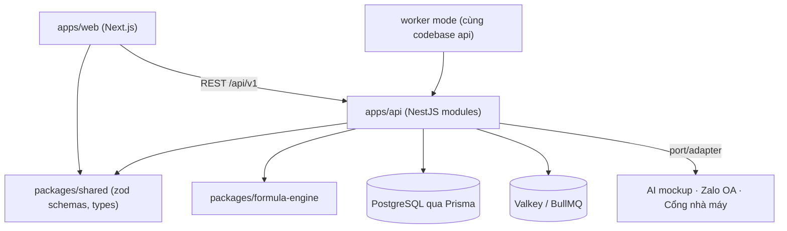
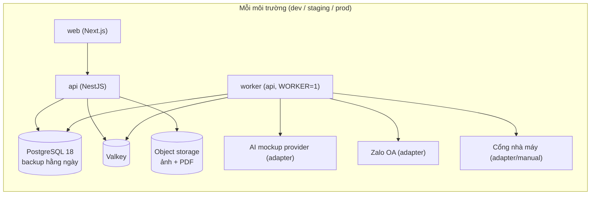

# Architecture Spine — ADG CPQ

## Design Paradigm

**Modular monolith** trên NestJS: một API duy nhất chia **module theo domain nghiệp vụ**, trong mỗi module là 3 lớp `controller → service → repository (Prisma)`. Frontend là app Next.js riêng, giao tiếp với API qua REST — không có logic nghiệp vụ ở frontend. Việc chậm chạy qua **job queue** (BullMQ) trong cùng codebase API, bật bằng chế độ worker.

Ánh xạ module ↔ domain:

| Module | Domain | Nhóm FR |
|---|---|---|
| `auth` | Đăng nhập, phiên, vai trò | F8 |
| `dealer` | Đại lý, gross đại lý | F8 |
| `customer` | Kho khách theo đại lý | F5 |
| `catalog` | Danh mục, sản phẩm, thông số dự án, phụ kiện | F1 |
| `component` | Loại/SKU linh kiện, auto-fill, tương thích | F2 |
| `material` | Vật tư, workbook BOM (Excel-as-engine [D14]) | F3 |
| `pricing` | Gross, range, VAT, tính giá | F4 |
| `quote` | Pipeline báo giá, hạng mục, snapshot, phát hành | F5, F7 |
| `mockup` | Ảnh AI (adapter + queue) | F6 |
| `delivery` | Gửi khách, gửi nhà máy, PDF | F7 |
| `audit` | config_audit_log, interceptor | F8 |
| `import-tools` | Nghiệm thu workbook (bộ ca mẫu), seed dữ liệu | F9 |

## Invariants & Rules

Chiều phụ thuộc cho phép (vi phạm = sai kiến trúc):



### AD-1 — Modular monolith NestJS, layered trong module

- **Binds:** all
- **Prevents:** hai dev/agent tự chọn kiến trúc khác nhau cho hai module (microservice lẻ, code nghiệp vụ trong controller, gọi thẳng Prisma từ controller).
- **Rule:** mỗi domain một NestJS module; trong module đi đúng `controller → service → repository`; module khác chỉ được gọi qua service export, không import repository của nhau. **Mỗi bảng DB có đúng một module chủ sở hữu** (toàn bộ nhóm `quote_*` thuộc `quote`) — module khác muốn đọc/ghi bảng đó phải đi qua service của module chủ, cấm mở repository thứ hai vào cùng bảng (đường ghi thứ hai sẽ né guard submitted/dealer-scope).

### AD-2 — Tính toán giá/BOM chỉ ở server

- **Binds:** F3, F4, F5 (FR-030..036, FR-046)
- **Prevents:** frontend tự tính giá → lệch kết quả với server và lộ công thức/gross ra client.
- **Rule:** mọi phép tính BOM, cost, gross, giá nhập, range, VAT, tổng chạy trong module `pricing`/`quote` phía API. Frontend chỉ hiển thị số server trả về; không có bản sao công thức nào ở client.

### AD-3 — Che dữ liệu mật ở tầng API bằng DTO whitelist

- **Binds:** F4, F5, F7 (NFR-01, FR-036)
- **Prevents:** field mật (cost_material, unit_price vật tư, gross, BOM chi tiết) lọt vào payload cho vai dealer rồi "giấu bằng UI".
- **Rule:** response DTO cho vai dealer là **whitelist** khai báo tường minh; field mật không xuất hiện trong DTO đó (kể cả giá trị null). Bộ e2e test có ca cố định: đăng nhập dealer, gọi mọi endpoint quote/pricing, assert không có field mật trong JSON.

### AD-4 — Một formula engine duy nhất cho auto-fill & tương thích *(thu hẹp theo D14)*

- **Binds:** F2 (FR-011, FR-012, FR-022)
- **Prevents:** auto-fill và điều kiện tương thích dùng hai bộ semantics khác nhau; hoặc dùng `eval` JS gây lỗ hổng.
- **Rule:** `packages/formula-engine` là parser AST tự viết theo đặc tả trong ERD Project Note (số học, so sánh, logic, `if`, `round/ceil/floor/min/max`, biến `proj.*`/`comp.*`). Pure function `(expression, variables) → value | typedError`, không truy cập I/O, không eval. **Phạm vi: chỉ auto-fill thông số linh kiện + điều kiện tương thích SKU — BOM KHÔNG đi qua engine này** (BOM tính bằng workbook Excel, xem AD-17). Package vẫn chứa `roundVnd()` (AD-6).

### AD-5 — Phát hành là transaction snapshot; sau submitted là bất biến

- **Binds:** F5, F7 (FR-060, FR-061, FR-065; D4)
- **Prevents:** hai luồng ghi giá theo hai đường (một đường tin giá nháp, một đường tính lại) → báo giá phát hành với số liệu không nhất quán; hoặc code khác sửa quote đã gửi.
- **Rule:** phân biệt hai loại cột tiền: **INPUT** (`selling_price` — đại lý chọn, persist bình thường ở nháp) và **DERIVED** (`cost_material`, `import_price`, `line_total`, tổng — chỉ được ghi bởi **một hàm định giá duy nhất** trong module `pricing`, kèm mốc `priced_at`; ở nháp là cache tham khảo). Phát hành = một transaction DB duy nhất: recompute qua đúng hàm đó → ghi snapshot (khách, sản phẩm, thông số, BOM, giá) → set `submitted`; chỉ số liệu tại publish là chân lý. Sau `submitted`, guard chung từ chối mọi mutation **trừ closed-list cột hệ thống**: `quote_pdf_url`, `valid_until` (ghi trong chính transaction publish) và các bảng trạng thái gửi (`customer_delivery`, `factory_bom_dispatch`) — không cột số liệu nào được ghi sau publish.

### AD-6 — Tiền là số nguyên VND, một hàm làm tròn

- **Binds:** F4 (FR-035)
- **Prevents:** mỗi chỗ làm tròn một kiểu → PDF, DB và tổng không khớp nhau.
- **Rule:** mọi giá trị tiền trong hệ thống là **số nguyên đồng**; làm tròn duy nhất qua `roundVnd()` trong `packages/formula-engine` (module money), áp tại từng dòng; tổng = cộng các dòng đã làm tròn, không làm tròn lại. Số lượng giữ 4 số lẻ. **Ánh xạ vật lý:** cột tiền map `BIGINT` trong Prisma schema (ERD ghi `decimal(18,2)` là logical — physical dùng bigint); JSON serialize **tiền là number** (an toàn trong phạm vi VND thực tế) — ngoại lệ có chủ đích của convention "bigint → string" vốn chỉ áp cho ID.

### AD-7 — Việc chậm đi qua queue, job idempotent

- **Binds:** F6, F7 (FR-050, FR-063, FR-064; NFR-06, NFR-07)
- **Prevents:** gọi AI/gửi OA/render PDF ngay trong request HTTP → timeout, mất job, double-send khi retry.
- **Rule:** AI mockup, render PDF, gửi khách, gửi nhà máy đều là BullMQ job. Job nhận id bản ghi (không nhận payload dữ liệu), tự đọc trạng thái mới nhất, **idempotent** (chạy lại không gửi đôi), cập nhật status vào bảng tương ứng; client theo dõi bằng polling status.

### AD-8 — Dealer scoping bắt buộc từ token

- **Binds:** F5, F8 (FR-040, FR-070; NFR-01)
- **Prevents:** đại lý A đọc/ghi dữ liệu đại lý B do quên filter hoặc tin `dealer_id` client gửi lên.
- **Rule:** `dealer_id` lấy **duy nhất từ phiên đăng nhập**; guard/decorator chung áp filter này cho mọi truy vấn dữ liệu thuộc đại lý (customer, quote). Endpoint nhận `dealer_id` từ body/query cho vai dealer là sai kiến trúc.

### AD-9 — Audit qua interceptor chung

- **Binds:** F1–F4, F8 (FR-073)
- **Prevents:** mỗi màn hình admin tự viết log tay → chỗ có chỗ không, khiếu nại giá không truy được.
- **Rule:** mọi mutation trên bảng cấu hình nhạy cảm (material, component_sku, accessory, pricing_config, dealer_product_gross, formula, system_setting) đi qua một interceptor/audit-service chung ghi `config_audit_log` (bảng, id, action, diff tóm tắt, user, thời điểm). Không viết insert audit rải rác.

### AD-10 — Một hợp đồng API: REST /api/v1 + zod shared

- **Binds:** all
- **Prevents:** FE và BE lệch shape dữ liệu; mỗi endpoint một kiểu lỗi.
- **Rule:** REST dưới `/api/v1`; schema request/response khai bằng zod trong `packages/shared` — FE và BE cùng import, không định nghĩa type trùng. Lỗi trả về một envelope duy nhất `{ error: { code, message, details? } }` với `code` ổn định; thông điệp người dùng bằng tiếng Việt.

### AD-11 — Web-first, chừa đường Zalo Mini App `[ADOPTED — D11]`

- **Binds:** all frontend (NFR-03, NFR-04)
- **Prevents:** lõi frontend phụ thuộc API riêng của ZMP → Phase 2 không bọc được; hoặc auth không mở được đường Zalo ID.
- **Rule:** frontend là Next.js responsive mobile-first chạy trình duyệt thường; không gọi SDK/API riêng của Zalo ở lõi. Auth dùng phiên (cookie httpOnly) qua endpoint `auth` — thêm OAuth Zalo sau này là thêm provider, không đổi mô hình phiên.

### AD-12 — PostgreSQL + Prisma là đường dữ liệu duy nhất `[ADOPTED — ERD]`

- **Binds:** all
- **Prevents:** truy cập DB bằng SQL tay rải rác / ORM thứ hai; schema trôi khỏi ERD đã review.
- **Rule:** Prisma schema sinh khởi đầu từ `docs/ADG_CPQ_ERD.dbml` (logical); khi code tồn tại, Prisma schema + migrations là nguồn physical duy nhất — đổi logical (thêm/bỏ bảng, đổi quan hệ) phải đối chiếu decision log. Raw SQL chỉ trong repository và phải có lý do ghi kèm.

### AD-13 — Tích hợp ngoài qua port/adapter

- **Binds:** F6, F7 (FR-050, FR-063, FR-064)
- **Prevents:** code nghiệp vụ gọi thẳng SDK của một nhà cung cấp (AI, Zalo, nhà máy) → đổi provider phải mổ lõi.
- **Rule:** mỗi tích hợp ngoài có interface trong module của nó (`MockupProvider`, `CustomerDeliveryChannel`, `FactoryDispatchChannel`); nghiệp vụ chỉ gọi interface; adapter cụ thể (kể cả adapter "manual/download") đăng ký qua DI. Provider AI và kênh nhà máy chưa chọn — adapter mock/manual dùng trước.

### AD-14 — Sở hữu lượt gen mock-up: đếm bằng dòng, giữ chỗ khi enqueue

- **Binds:** F6 (FR-050, FR-051; D6)
- **Prevents:** API và worker đếm lượt hai kiểu (đốt lượt khi fail kỹ thuật — trái D6; hoặc retry đếm đôi); race trên `generation_no`; reset lượt khi thay ảnh đâm vào unique index cũ.
- **Rule:** không có cột đếm tay. Enqueue tạo ngay một dòng `quote_item_ai_image` trạng thái `pending` (giữ chỗ, chống race); job cập nhật thành `succeeded` hoặc `failed_technical`. **Số lượt đã dùng = số dòng không phải `failed_technical` tạo sau lần thay ảnh hiện trường gần nhất** (`field_photo_updated_at`); `generation_no` tăng đơn điệu theo hạng mục, không bao giờ tái sử dụng (thay ảnh không xoá dòng cũ). ERD đã điều chỉnh tương ứng (enum `ai_image_status`, bỏ `ai_generation_count`).

### AD-15 — PII & thông tin xác thực có ranh giới

- **Binds:** all (NFR-02; Nghị định 13/2023/NĐ-CP)
- **Prevents:** PII khách hàng và bí mật xác thực rò rỉ qua log/response/bảng phụ do mỗi dev tự xử.
- **Rule:** mật khẩu băm Argon2id (hoặc bcrypt) — không bao giờ log/serialize. PII khách (tên, SĐT, địa chỉ) chỉ tồn tại ở bảng `customer` và các cột snapshot trong `quote` — không sao chép sang bảng khác, không xuất hiện trong log ở mọi mức. HTTPS bắt buộc mọi môi trường trừ dev local. Yêu cầu xoá dữ liệu cá nhân: xoá/ẩn ở `customer`; snapshot trong báo giá đã phát hành giữ lại phục vụ nghĩa vụ hợp đồng — chính sách retention cụ thể là câu hỏi pháp lý (xem Deferred).

### AD-16 — Đồng thời trên nháp: khoá lạc quan

- **Binds:** F5 (NFR-10)
- **Prevents:** hai tài khoản cùng đại lý mở cùng một nháp và ghi đè âm thầm lẫn nhau — mỗi dev tự xử một kiểu (last-write-wins chỗ này, lock chỗ kia).
- **Rule:** mọi mutation lên `quote`/`quote_item` ở trạng thái nháp mang theo `updated_at` client đã đọc; server so khớp trước khi ghi — lệch thì từ chối với mã lỗi chuẩn `DRAFT_CONFLICT` (409), client tải lại. Không dùng khoá bi quan/khoá phiên.

### AD-17 — BOM tính bằng workbook Excel qua hợp đồng INPUT/OUTPUT `[ADOPTED — D14]`

- **Binds:** F3, F9 (FR-021, FR-023, FR-030, FR-090, FR-091)
- **Prevents:** hệ thống tái hiện logic Excel rồi lệch với file gốc; mỗi dev tự chế cách đọc file; file bị sửa ngoài luồng lọt vào production; BOM tính trong request HTTP gây timeout.
- **Rule:** logic BOM **nằm nguyên trong file Excel** — hệ thống không import/không tái hiện công thức. Mỗi sản phẩm một `product_bom_workbook` **phiên bản hoá + checksum**, chỉ version vượt nghiệm thu bộ ca mẫu mới được active (một active/sản phẩm — F4). Việc tính đi qua **một adapter duy nhất** `BomWorkbookEngine` (interface trong module `material`): nhận `(workbookVersionId, params)` → ghi named ranges sheet INPUT → tính → đọc bảng OUTPUT chuẩn `[material_code, quantity]` `[OPEN O9]` → trả typed result/error. Engine cụ thể chọn bằng **story spike** trên file thật (ứng viên: LibreOffice headless, HyperFormula, sidecar Python `formulas`); macro/VBA không hỗ trợ. Chạy trong worker khi thuộc luồng chậm (AD-7); mọi lần tính ghi lại `bom_workbook_version` vào hạng mục.

## Consistency Conventions

| Concern | Convention |
| --- | --- |
| Naming DB | Bảng/cột `snake_case` đúng theo ERD dbml; không đổi tên khi sinh Prisma schema (`@@map`/`@map` nếu cần) |
| Naming code | TypeScript `camelCase`; class `PascalCase`; DTO hậu tố `Dto`; module thư mục `kebab-case` |
| ID | `bigint` autoincrement (theo ERD); serialize ra JSON dạng string |
| Thời gian | Lưu `timestamptz` UTC; hiển thị múi giờ `Asia/Ho_Chi_Minh`; format ngày `dd/MM/yyyy` |
| Tiền & số lượng | Integer VND, BIGINT physical, serialize number (AD-6); quantity `decimal(18,4)`; không dùng float cho tiền ở bất kỳ tầng nào |
| Lỗi | Envelope AD-10; `code` dạng `SCREAMING_SNAKE` ổn định (vd `PRICE_OUT_OF_RANGE`, `SKU_INCOMPATIBLE`, `DRAFT_CONFLICT`) |
| Trạng thái | Enum trong DB theo ERD; TS dùng union type sinh từ zod, không hardcode chuỗi rải rác |
| Config | Biến môi trường qua `@nestjs/config` + zod validate lúc boot; cấu hình nghiệp vụ (VAT, lượt gen...) đọc từ `system_setting`, không từ env |
| Logging | Log có cấu trúc (JSON) kèm `quoteId`/`dealerId` khi có; không log dữ liệu mật (giá vốn, gross) và PII (AD-15) |
| i18n | MVP một ngôn ngữ tiếng Việt; chuỗi UI/thông báo tập trung constants, không rải trong JSX/service |
| Test | Unit cho formula-engine + pricing (bắt buộc); e2e cho pipeline phát hành và ca bảo mật AD-3/AD-8 |

## Stack

Đã xác minh phiên bản hiện hành trên web 03/07/2026 — hai vòng: lúc soạn và qua reviewer kiểm chứng độc lập (nguồn trong `review-versions.md`).

| Name | Version |
| --- | --- |
| Node.js | **24 LTS (Krypton)** — Active LTS đến 04/2028, pin `.nvmrc` |
| TypeScript | 5.x |
| Next.js (apps/web) | 16.2.x LTS |
| NestJS (apps/api) | 11.1.x — **pin v11**, không nhảy v12 (ESM, GA Q3/2026) giữa dự án; đánh giá lại sau MVP |
| Prisma ORM | 7.x |
| PostgreSQL | **18.x** — greenfield vào major chín hiện hành (GA 09/2025) |
| Queue store | **Valkey 8+** (BSD-3, BullMQ chạy full test suite chính thức) hoặc Redis 8 (AGPL) |
| BullMQ | bản hiện hành |
| zod | bản hiện hành (schemas shared) |
| Playwright (render PDF từ template HTML) | bản hiện hành |
| Object storage (ảnh, PDF, workbook BOM) | S3-compatible — ưu tiên cloud VN / Garage / SeaweedFS; nếu MinIO CE thì chấp nhận quản trị CLI-only (Web UI đã bị gỡ khỏi bản community) `[theo hạ tầng — Deferred]` |
| Engine tính workbook Excel (AD-17) | **Spike trên file thật** — ứng viên: LibreOffice headless / HyperFormula / sidecar Python `formulas` |
| pnpm | **11.x**, pin qua trường `packageManager` |

## Structural Seed

```text
adg-cpq/
  apps/
    api/                    # NestJS: các module theo bảng ánh xạ ở Design Paradigm
      src/modules/<domain>/ # controller / service / repository / dto per module
      src/common/           # guards (dealer-scope, submitted), interceptors (audit), error envelope
    web/                    # Next.js 16 App Router
      app/(dealer)/         # pipeline báo giá — mobile-first
      app/admin/            # quản trị — desktop-first
  packages/
    shared/                 # zod schemas, types, error codes, constants tiếng Việt
    formula-engine/         # parser AST + money (roundVnd) + golden-test harness
  docs/                     # tài liệu nghiệp vụ v2 (đã có)
  docker-compose.yml        # api, web, worker(=api chế độ worker), postgres, valkey, object storage
```

Triển khai & môi trường `[ASSUMPTION — hạ tầng chưa chốt]`:



- 3 môi trường dev / staging / prod, đóng gói Docker Compose; prod một máy đủ cho NFR-05 (50 đồng thời) — không cần phân tán.
- Nhà cung cấp hạ tầng (server công ty vs cloud VN) là **câu hỏi mở**, phải chốt trước pilot; kiến trúc không phụ thuộc lựa chọn này.

## Capability → Architecture Map

| Capability | Lives in | Governed by |
| --- | --- | --- |
| F1 Catalog & sản phẩm | `catalog` | AD-1, AD-9, AD-12 |
| F2 Linh kiện & tương thích | `component` + `formula-engine` | AD-1, AD-4 |
| F3 Vật tư & BOM | `material` + adapter `BomWorkbookEngine` | AD-6, AD-17 |
| F4 Định giá | `pricing` | AD-2, AD-3, AD-5, AD-6 |
| F5 Pipeline báo giá | `quote`, `customer` | AD-2, AD-5, AD-8, AD-16 |
| F6 Mock-up AI | `mockup` (+queue) | AD-7, AD-13, AD-14 |
| F7 Phát hành & gửi | `quote`, `delivery` (+queue) | AD-5, AD-7, AD-13 |
| F8 Quản trị & audit | `auth`, `dealer`, `audit` | AD-8, AD-9, AD-15 |
| F9 Nghiệm thu workbook | `import-tools` + adapter `BomWorkbookEngine` | AD-17 |
| Seed dữ liệu ban đầu (vật tư + đơn giá, SKU linh kiện, ~300 đại lý + gross, admin bootstrap) | `import-tools` — công cụ import CSV/Excel, build trong MVP trước pilot | AD-9, AD-12 |

## Deferred

| Quyết định | Vì sao chờ được |
| --- | --- |
| Nhà cung cấp AI mockup | Adapter interface (AD-13) cách ly; chọn khi test chất lượng ảnh + chi phí/lần — cần trước khi build F6 thật |
| Engine tính workbook Excel cụ thể | Adapter `BomWorkbookEngine` (AD-17) cách ly; chốt bằng spike trên file Excel thật của công ty — cần trước khi build F3 thật |
| Nội dung OUTPUT workbook (chỉ số lượng hay cả tiền) | `[OPEN O9]` — hợp đồng OUTPUT viết theo khuyến nghị [material_code, quantity]; đổi khi xem file thật chỉ chạm FR-030/AD-17, không lan rộng |
| Kênh + format gửi nhà máy tự động | `[OPEN O4]`; MVP xuất file chuẩn qua adapter manual |
| Hạ tầng deploy (server công ty vs cloud VN) | Docker hoá nên chuyển được; chốt trước pilot |
| CI/CD chi tiết | Sau khi repo có code; tối thiểu: lint + test + build mỗi PR |
| Bọc Zalo Mini App | Phase 2; AD-11 đã giữ đường |
| Giá trị cấu hình O1/O2/O3 | Nhập qua admin khi công ty ban hành |
| Chi tiết physical DB (index phụ, partition) | Code + dữ liệu thật quyết định; ERD logical đã đủ cho MVP |
| Chính sách retention/xoá PII trong snapshot đã phát hành (Nghị định 13) | Cần ý kiến pháp lý; AD-15 đã khoanh ranh giới dữ liệu — chốt trước pilot |
| Đường upload ảnh (qua API vs presigned direct-to-storage) | Quyết khi build FR-042; không ảnh hưởng AD nào |
| Backup/alerting cụ thể (tần suất, công cụ giám sát) | Chốt cùng lựa chọn hạ tầng, trước pilot |
